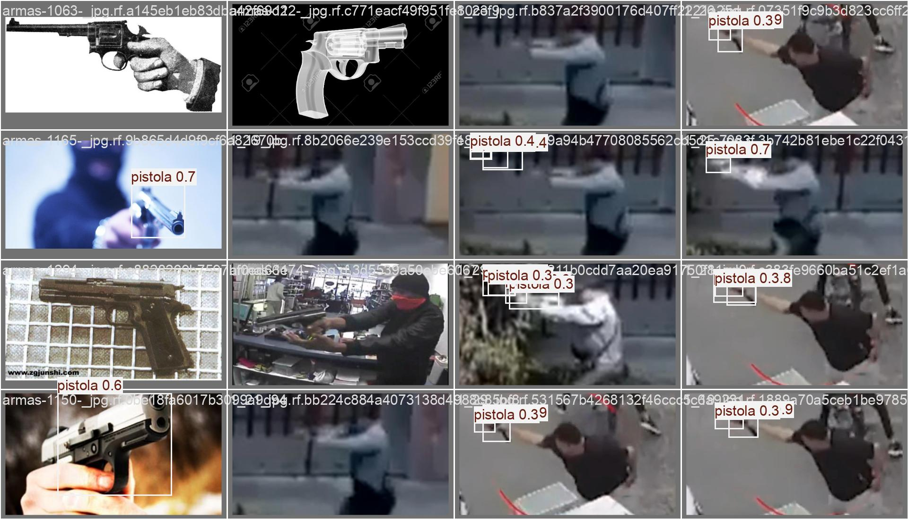
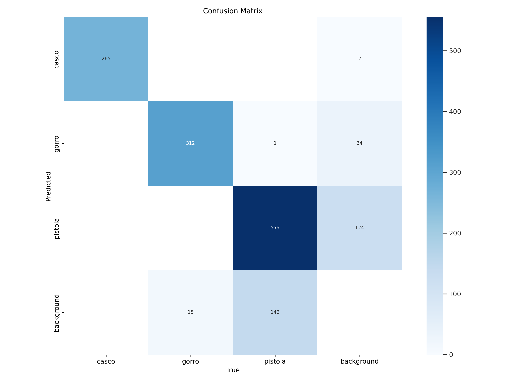
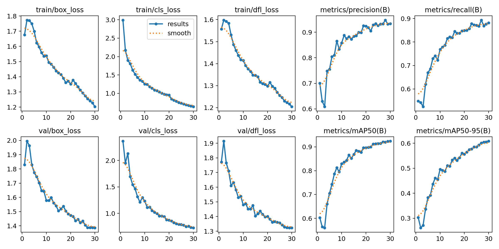

# Sistema de Vigilância Baseado em IA para Prevenção de Crimes com Armas e Disfarces


Trabalho de Conclusão de Curso (TCC) em visão computacional aplicada à segurança: detecção automática de **armas e disfarces** em vídeo, comparando três versões da arquitetura **YOLO** (v8, v9 e v10) treinadas no mesmo dataset.

Este repositório contém os resultados do treinamento dos três modelos e o script principal de **detecção de objetos em vídeo**. O dataset completo não está incluído (por tamanho) e pode ser baixado via Google Drive — ver `links_dataset.txt`.

## Objetivo

Comparar, sob as mesmas condições de dataset e data augmentation, a precisão e o comportamento de **YOLOv8**, **YOLOv9** e **YOLOv10** na detecção de objetos relevantes à segurança (armas e disfarces), avaliando qual arquitetura entrega o melhor equilíbrio entre precisão e desempenho.

## Resultados (YOLOv8)

Predições do modelo em imagens de validação — bounding boxes geradas automaticamente:



Matriz de confusão do treinamento:



Curvas de métricas (precisão, recall, mAP) ao longo do treinamento:



> As mesmas métricas para YOLOv9 e YOLOv10 estão em `results/yolov9/` e `results/yolov10/`.

## Estrutura do Repositório

```
tcc-yolo/
├── scripts/
│   ├── detectar_video.py      Script principal: roda a detecção em vídeo
│   └── train_yolo_colab.py    Script de treinamento (Google Colab)
├── models/
│   ├── yolov8/                 Pesos treinados (best.pt / last.pt)
│   ├── yolov9/
│   └── yolov10/
├── results/
│   ├── yolov8/                 Métricas e gráficos do treinamento
│   ├── yolov9/
│   └── yolov10/
├── docs/
├── logs/
├── links_dataset.txt            Links do dataset completo (Google Drive)
└── requirements.txt
```

## Dataset

O **dataset completo** está hospedado no Google Drive devido ao seu tamanho. Para baixá-lo, consulte o arquivo `links_dataset.txt`.

O dataset inclui imagens divididas em:

- `train/` — conjunto de treinamento
- `valid/` — conjunto de validação
- `test/` — conjunto de teste

Técnicas de **data augmentation** aplicadas:

- Giro e espelhamento (horizontal/vertical)
- Ajuste de brilho, contraste e saturação
- Inserção de ruídos aleatórios (Gaussian Noise)
- Corte aleatório (random crop)
- Zoom e rotação leve (affine transform)

## Requisitos

- Python 3.10 ou superior
- GPU recomendada para processamento em tempo real

```bash
pip install -r requirements.txt
# ou, mínimo necessário:
pip install ultralytics opencv-python numpy
```

## Executando a detecção

1. Baixe os pesos desejados (`best.pt` ou `last.pt`) de `models/yolov8/`, `models/yolov9/` ou `models/yolov10/`.
2. Coloque o vídeo de teste na pasta `videos/` (crie a pasta se não existir) e ajuste o caminho no script `scripts/detectar_video.py`.
3. Execute:

```bash
python scripts/detectar_video.py
```

O script:

- Processa o vídeo frame a frame
- Desenha **bounding boxes** com cores únicas por classe
- Salva todas as detecções em `logs/log_deteccoes.txt`
- Exibe o vídeo em tempo real (pressione `ESC` para sair)

> Por padrão, o script carrega o modelo YOLOv8 (`best.pt`). Para usar YOLOv9 ou YOLOv10, altere o caminho do modelo dentro do script.

## Treinamento no Google Colab

Para treinar qualquer um dos três modelos, use `scripts/train_yolo_colab.py`:

1. Suba o `.zip` do dataset no Google Drive.
2. Abra o Colab e execute o script.
3. Escolha o modelo pela variável `modelo_escolhido` (`v8`, `v9` ou `v10`).
4. O script treina o modelo, salva os resultados em `/content/TCC/resultados/yolov{modelo}` e gera um `.zip` para download.

## Autor

**Elton Barbosa** — Engenheiro de Computação (UFPA, Campus Tucuruí)

- Portfólio: [eltonbarbosaa.github.io](https://eltonbarbosaa.github.io)
- GitHub: [@eltonbarbosaa](https://github.com/eltonbarbosaa)
- E-mail: [elton.baarbosa@gmail.com](mailto:elton.baarbosa@gmail.com)
